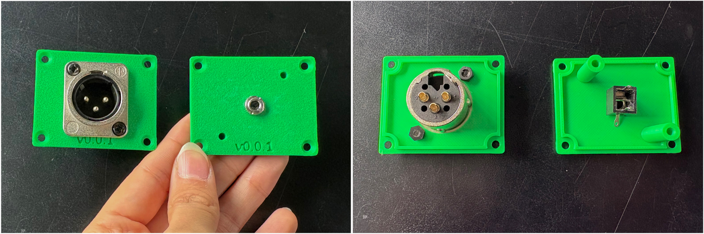

# Semana-10

## Resumen de días, temas y horas

| Fecha      | Día      | Temas                                                | Lugar     | Horas día / hora semana |
| :--------- | :------- | :--------------------------------------------------- | :-------- | :---------------------- |
| 2026-09-28 | Lunes    | GitHub, OpenSCAD, Impresión 3D                       | LID       | 009 / 009               |
| 2026-09-29 | Martes   | OpenSCAD, Impresión 3D, Magíster en Artes Mediales   | República 180, UCH | 007 / 016               |
| 2026-10-01 | Jueves   |                                                      |           | 000 / 000               |
| 2026-10-02 | Viernes  |                                                      |           | 000 / 000               |
| 2026-10-03 | Sábado   |                                                      |           | 000 / 000               |
| 2026-10-04 | Domingo  | Documentación                                        | Casa      | 003 / 019               |

## Componentes

Fuimos a buscar a Pedro de Valdivia los componentes que llegaron de **[Thonk](https://www.thonk.co.uk/)** desde Inglaterra. Pedimos **fuentes de poder, perillas, potenciómetros, tornillos, golillas** y todos los componentes necesarios para poder seguir desarrollando los **Popusintes**.

## VCV Rack

Hacer copia de Popusíntesis.

## Tacto 48

### Caja para amplificador piezoeléctrico

**Tacto 48** es un amplificador para micrófono piezoeléctrico (de contacto). Esta semana diseñé su caja en **OpenSCAD**, de 50 × 40 × 80 mm y basada en un perfil de aluminio de JLC pero con las paredes lisas, para imprimirla en 3D y probar que los conectores calcen en las perforaciones. Por el momento, la caja solo tiene:

- Entrada XLR.

- Salida para jack TS de 1/4" o de 1/8".

Como referencia revisé este modelo de caja 1590A imprimible en 3D:

https://cults3d.com/es/modelo-3d/artilugios/1590a-pedal-case-enclosure-3d-printable

#### Diseño e impresión

Para el diseño y la impresión, primero hice una copia del repositorio de **Tacto 48**, donde está el código del diseño de la PCB. Ahí creé una nueva carpeta llamada **[modelado-caja](https://github.com/Bernardita-Jesus/tacto48/tree/main/modelado-caja)**, en la que subí los modelados de la caja.

Organicé el código en varios archivos, para que cada uno tenga una sola función:

- **tacto48.scad:** Es el archivo principal. Con la variable **pieza** elijo qué ver: la caja, la tapa del jack, la tapa del XLR o todo el ensamble.

- **tacto48_caja.scad:** Es el perfil de la caja, extruido a lo largo y abierto en los dos extremos, con columnas en las esquinas para los tornillos M3 de las tapas.

- **tacto48_tapa.scad:** Son las dos tapas que cierran los extremos. Una lleva la perforación del jack y dos separadores hacia adentro para atornillar la PCB rev-b; la otra lleva la perforación del XLR.

- **constantes.scad:** Aquí están todas las medidas: el perfil, los tornillos, las tapas, los conectores y la PCB. Al inicio está **TOLERANCIA**, el juego del encaje entre la tapa y la caja, que puedo subir o bajar según la impresora.

- **formas.scad:** Son los módulos generales que reutilizo en todas las piezas, como el rectángulo con esquinas redondeadas y las perforaciones y cilindros para los tornillos M3.

Como todas las medidas están en constantes, puedo cambiar una medida o una tolerancia en un solo lugar y se actualizan todas las piezas. Lo más importante es que así pude probar las dimensiones de las perforaciones de las piezas que tenían que apernarse: el jack TS de 3,5 mm (agujero de 6,2 mm), el XLR (24 mm más la tolerancia, con dos tornillos M3 en diagonal) y los tornillos M3 de las tapas y de la PCB.

También incluí un control de versiones. La versión está en la constante **VERSION** y se graba con **difference()** en cada pieza: en la cara exterior de las tapas, bajo el conector, y en el costado izquierdo de la caja. Así, cuando imprimo una prueba, sé exactamente a qué versión del código corresponde. En el README de la carpeta anoté qué tiene cada versión, partiendo por la **v0.0.1**, y cada vez que la cambio vuelvo a exportar los STL.

En la siguiente captura se puede ver el código principal de **Tacto 48** en **OpenSCAD** y el ensamble de la caja con sus tapas.

En la siguiente captura se puede ver la impresión de las tapas de la caja desde la cámara de la Bambu Lab, en Bambu Studio.

En la siguiente foto se pueden ver las tapas ya impresas en 3D, versión **v0.0.1**, por fuera y por dentro: una con el conector XLR y otra con el jack de 1/8".

#### Referencias

- **Boss CH-2:** Es un pedal que cumple con el estándar de tener la **entrada a la derecha y la salida a la izquierda**, y lo tomo como referencia para ubicar los conectores.

- **Drum Thing de Electro-Faustus:** Es un ejemplo de amplificador piezoeléctrico.

- **Por investigar:** Micrófono condensador y preamplificador para piezo.

#### Componentes y proveedores

- https://audiosystemsmusic.cl/products/rea0024

- Jack mono GLS: https://www.cabezacuadrada.cl/product/jack-mono-gls/

- Jack mono cerrado: https://www.cabezacuadrada.cl/product/jack-mono-cerrado/

- Búsqueda de componentes en Katode: https://www.katode.cl/busqueda
