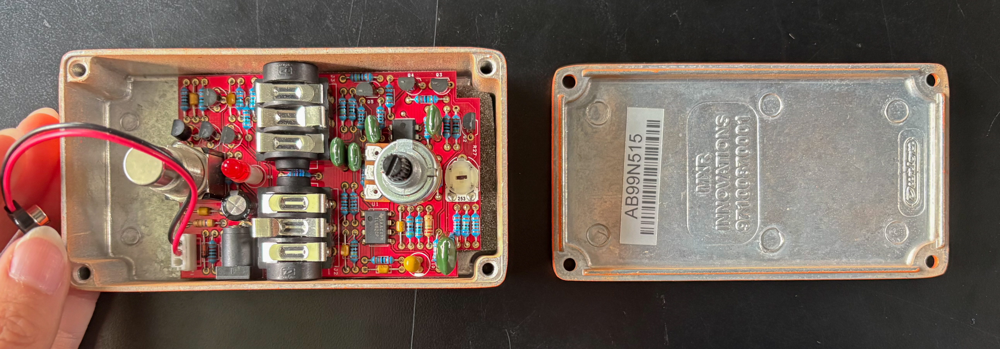
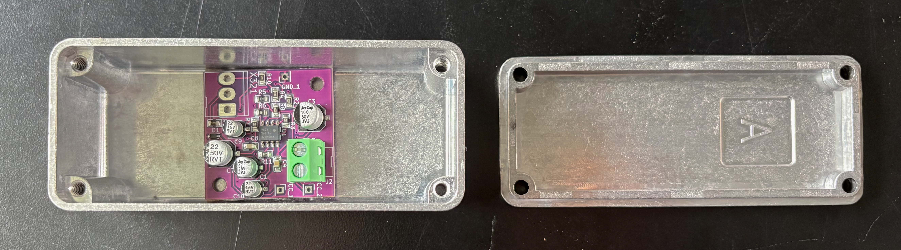

# Semana-11

## Resumen de días, temas y horas

| Fecha      | Día      | Temas                                                | Lugar     | Horas día / hora semana |
| :--------- | :------- | :--------------------------------------------------- | :-------- | :---------------------- |
| 2026-10-05 | Lunes    |                                                      | LID       | 008 / 008               |
| 2026-10-06 | Martes   |                                                      | República 180 | 004 / 012               |
| 2026-10-07 | Miércoles | OpenSCAD, Investigación de materiales               | Casa      | 006 / 018               |
| 2026-10-08 | Jueves   | OpenSCAD                                             | LID       | 003 / 021               |
| 2026-10-09 | Viernes  |                                                      |           | 000 / 000               |
| 2026-10-10 | Sábado   |                                                      |           | 000 / 000               |
| 2026-10-11 | Domingo  |                                                      |           | 000 / 000               |

## Tacto 48

**Tacto 48** es un amplificador para micrófono piezoeléctrico (de contacto), que va dentro de una caja Hammond. La semana pasada diseñé la caja en **OpenSCAD** y la imprimí en 3D en la Bambu Lab; para probar las perforaciones que encajen los elementos, la caja solo tiene:

En la siguiente foto se pueden ver las tapas impresas en 3D de la versión **v0.0.1**, por fuera y por dentro; una con el conector XLR y otra con el jack de 1/8".

- Entrada XLR.

- Salida para jack TS de 1/4" o de 1/8".

Como referencia, sigo el estándar de pedales como el **Boss CH-2**, con la **entrada a la derecha y la salida a la izquierda**. Un ejemplo de amplificador piezoeléctrico es el **Drum Thing de Electro-Faustus**.

Esta semana mi objetivo es pasar de la caja impresa en 3D a la caja de aluminio Hammond.

Antes de comenzar a diagramar dónde debería ir cada elemento, que en el fondo son tres, como mencioné: la entrada jack, la salida XLR y la PCB, desarmé un pedal para poder ver otro tipo de soluciones de diseño que han tomado algunas marcas en sus productos al utilizar cajas Hammond.

En la siguiente foto se puede ver el pedal que desarmé, con la caja abierta y la tapa al lado. Muestra cómo ubicaron los jacks, el potenciómetro, el LED, el conector de alimentación y la PCB dentro de una caja Hammond.

https://www.3m.com/3M/en_US/dual-lock-reclosable-fasteners-us/

### Caja Hammond

Esta es la caja Hammond que vamos a utilizar para el producto.

https://www.katode.cl/cajas-de-aluminio/159-caja-aluminio-1590a-ultra-pequena.html

### Propuesta de diagramación de la caja Hammond

La caja Hammond 1590A mide aproximadamente 92,6 × 38,5 × 31 mm por fuera (tengo que confirmar las medidas en la hoja de datos de Hammond). Es una caja muy pequeña, así que la ubicación de cada componente depende sobre todo del espacio que ocupa por dentro, no solo del agujero.

Los componentes que tiene que llevar la caja son tres:

- **Entrada jack TS:** Para el micrófono piezoeléctrico, de 1/8.

- **Salida XLR:** Como fuente de poder y salida.

- **PCB:** El circuito del amplificador.

#### Ubicación de cada componente

- **Entrada jack (cara lateral derecha):** Siguiendo el estándar de pedales como el Boss CH-2, pongo la entrada en el lado derecho, centrada en altura y cerca del extremo inferior de la caja. El jack de 1/8 de aproximadamente 6 mm.

- **Salida XLR (cara superior, extremo opuesto):** El conector XLR de panel es la pieza más grande. Su base mide casi lo mismo que la altura de la caja, así que en las caras laterales probablemente no cabe. Por eso propongo ponerlo en la cara superior, en el extremo contrario al jack, para que los cables no se crucen y el conector quede accesible.

- **PCB (fondo de la caja, al centro):** La PCB va adento de la caja, arriba, La fijaré con el velcro **3M Dual Lock** o con separadores (standoffs), y pongo una lámina aislante debajo, porque el aluminio conduce electricidad.

En la siguiente foto se puede ver la caja de aluminio tipo Hammond, abierta, con la PCB pequeña en el fondo y una bornera verde para conectar los cables.

### Diagramación de laa caja Hammond

### Limitaciones del corte láser en aluminio

- **Láser CO2:** Es el láser más común y no corta aluminio. El aluminio refleja casi toda la luz de este tipo de láser. No alcanza a fundir el metal. Además, ese reflejo puede dañar los espejos y el lente de la máquina.

- **Grosor:** El grosor máximo depende de la potencia del láser de fibra; a mayor grosor, más potencia y peor terminación del borde. Tengo que preguntarle al proveedor qué grosores corta.

- **Marcado vs. corte:** Algunos láseres, como los que hay en la universidad, solo sirven para grabar o marcar la superficie, no para atravesar el metal.

- **Forma de la pieza:** El corte láser trabaja sobre planchas planas. La caja Hammond ya viene armada en 3D, así que no se podría cortar en una cortadora láser plana; las perforaciones para los jacks o la salida XLR se deberían hacer con taladro y brocas escalonadas, usando una guía de corte, o plantilla, pegada sobre la caja.

### Plantillas y guías de corte

- **Plantilla de papel impresa:** Imprimo el plano con los agujeros a escala 1:1, lo pegaría con cinta a la caja y marcaría cada centro con un punzón antes de taladrar. Las plantillas se perderían.

- **Plantilla de acrílico o MDF cortada en láser:** Corto una placa con los agujeros en la cortadora láser, la apoyo sobre las caras de la caja y marco o perforo a través de ella. Se podría reutilizar.

- **Jig impreso en 3D:** Es una pieza que encaja sobre la caja como una tapa, con los agujeros ya ubicados. No se mueve al taladrar.

